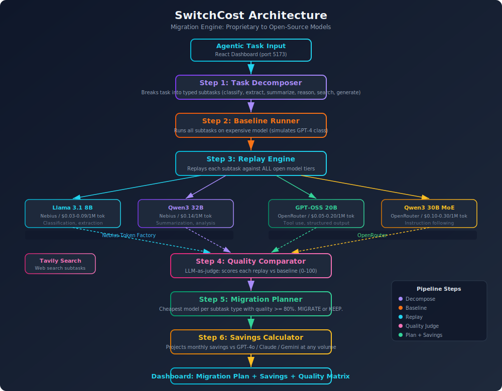

# SwitchCost

> Migrate from proprietary to open-source models. See exactly what you save.

**Built at [Nebius Build SF 2026](https://cerebralvalley.ai/events/~/e/nebius-build-sf) | Track 1: Edge Inference & Agents**

---

## The Problem

AI teams building agents on proprietary APIs face a cost crisis:
- **GPT-4o** costs $2.50-10/M tokens. **Claude** costs $3-15/M tokens.
- A production agent making 100k calls/day can cost **$3,000-15,000/month** in inference.
- Open models on Nebius Token Factory cost **$0.03-2.40/M tokens** (10-100x cheaper).
- Teams don't migrate because they have **no visibility** into which calls can safely move without quality regression.

The result: AI startups bleed money on inference while cheaper open-model alternatives go unused.

## The Solution

SwitchCost is a 3-step migration engine:

### Step 1: Capture
Ingest a complex agentic task. Decompose it into typed subtasks: classification, extraction, summarization, reasoning, search, generation.

### Step 2: Replay and Profile
Run the baseline on the most expensive model (simulating proprietary). Then replay every subtask against each open model tier on Nebius Token Factory and OpenRouter. For each replay, measure quality (LLM-as-judge vs baseline), latency, and exact cost.

### Step 3: Migration Plan
For each subtask type, recommend the cheapest open model that maintains quality parity (>= 80% match). Show projected monthly savings. Show the quality matrix. Adjust the volume slider to see how savings scale.

## Architecture

<p align="center">
  
</p>

### Pipeline

```
User submits agentic task
        |
        v
  Task Decomposer ----------> Breaks into typed subtasks
        |
        v
  Baseline Runner ----------> Runs all on expensive model (GPT-4 class proxy)
        |
        v
  Replay Engine -------------> Replays each subtask against ALL open models
     /     |     \              (Nebius Token Factory + OpenRouter)
    v      v      v
 Small   Mid    Large
 Model   Model  Model
    \      |      /
     v     v     v
  Quality Comparator --------> LLM-as-judge: scores each replay vs baseline (0-100)
        |
        v
  Migration Planner ---------> Cheapest model per type with quality >= 80%
        |
        v
  Savings Calculator --------> Projects monthly savings at any volume
        |
        v
  Dashboard -----------------> Migration plan, savings slider, quality matrix
```

## Model Registry

### Nebius Token Factory (Primary)

| Model Key | Model | Tier | Cost/1M In | Cost/1M Out |
|-----------|-------|------|-----------|------------|
| `nebius-small` | Meta-Llama-3.1-8B-Instruct-fast | Small | $0.03 | $0.09 |
| `nebius-mid` | Qwen/Qwen3-32B | Mid | $0.14 | $0.14 |
| `nebius-large` | DeepSeek-R1-0528 (671B MoE) | Large | $0.80 | $2.40 |

### OpenRouter (Secondary)

| Model Key | Model | Tier | Cost/1M In | Cost/1M Out |
|-----------|-------|------|-----------|------------|
| `openrouter-small` | openai/gpt-oss-20b | Small | $0.05 | $0.20 |
| `openrouter-mid` | qwen/qwen3-30b-a3b | Mid | $0.10 | $0.30 |

### Proprietary Reference Pricing (for savings calculator)

| Model | Cost/1M In | Cost/1M Out |
|-------|-----------|------------|
| GPT-4o | $2.50 | $10.00 |
| GPT-4 Turbo | $10.00 | $30.00 |
| Claude 3.5 Sonnet | $3.00 | $15.00 |
| Gemini 1.5 Pro | $1.25 | $5.00 |

## Tech Stack

| Layer | Technology |
|-------|-----------|
| **Backend** | Python 3.11+, FastAPI, asyncio, uvicorn |
| **Frontend** | React 18, Vite, TailwindCSS, Recharts |
| **Inference** | OpenAI SDK (compatible with Nebius + OpenRouter) |
| **Search** | Tavily Python SDK |
| **Quality Eval** | LLM-as-judge (comparative scoring 0-100) |
| **Package Management** | uv (Python), npm (frontend) |

## API Endpoints

| Method | Endpoint | Description |
|--------|----------|-------------|
| `POST` | `/api/analyze` | Start full migration analysis for a task |
| `GET` | `/api/analyze/{id}` | Get analysis status and results |
| `GET` | `/api/analyze/{id}/plan` | Get migration plan and quality matrix |
| `GET` | `/api/analyze/{id}/quality-matrix` | Get quality scores heatmap data |
| `POST` | `/api/savings-calculator` | Calculate savings with custom volume/model |
| `GET` | `/api/proprietary-models` | Get proprietary model pricing |
| `GET` | `/api/demo-task` | Get pre-configured demo task |
| `WS` | `/ws/analyze/{id}` | Real-time analysis progress streaming |
| `GET` | `/health` | Health check |

## Dashboard Components

- **Migration Plan** (hero) -- MIGRATE/KEEP verdicts per subtask type with quality bars
- **Savings Calculator** -- big savings number, volume slider (100 to 1M), proprietary model dropdown
- **Quality Matrix** -- heatmap of quality scores per (model, subtask type) pair
- **Cost Comparison Chart** -- baseline vs recommended cost per subtask type
- **Analysis Timeline** -- baseline steps with replay cards showing quality scores

## Quick Start

### Prerequisites

- Python 3.11+
- Node.js 18+
- [uv](https://github.com/astral-sh/uv) package manager

### Setup

```bash
git clone https://github.com/YOUR_USERNAME/switchcost.git
cd switchcost

cp .env.example .env
# Edit .env with your API keys

chmod +x scripts/setup.sh
bash scripts/setup.sh
```

### Run

```bash
# Terminal 1: Backend
cd backend
source .venv/bin/activate
uvicorn main:app --reload --port 8000

# Terminal 2: Frontend
cd frontend
npm run dev
```

- Dashboard: http://localhost:5173
- API Docs: http://localhost:8000/docs

### Environment Variables

```
NEBIUS_API_KEY=your_nebius_token_factory_key      # Required
OPENROUTER_API_KEY=your_openrouter_key            # Required
TAVILY_API_KEY=your_tavily_key                    # Required
```

## Project Structure

```
switchcost/
├── backend/
│   ├── main.py                  # FastAPI app entry point
│   ├── config.py                # Model registry, proprietary pricing, constants
│   ├── core/
│   │   ├── decomposer.py       # LLM-powered task decomposition
│   │   ├── baseline.py         # Baseline execution on expensive model
│   │   ├── replay.py           # Replay engine against all open models
│   │   ├── comparator.py       # LLM-as-judge quality comparison (0-100)
│   │   ├── planner.py          # Migration plan builder
│   │   ├── savings.py          # Savings projection calculator
│   │   └── metrics.py          # Metrics collection utilities
│   ├── services/
│   │   ├── provider.py         # Unified Nebius/OpenRouter inference client
│   │   └── tavily_search.py    # Tavily web search integration
│   ├── api/
│   │   ├── routes.py           # REST API endpoints
│   │   └── websocket.py        # WebSocket for live progress streaming
│   └── models/
│       └── schemas.py          # Pydantic data models
├── frontend/
│   ├── src/
│   │   ├── App.jsx             # Main dashboard component
│   │   ├── components/
│   │   │   ├── TaskInput.jsx   # Task submission form
│   │   │   ├── MigrationPlan.jsx # Hero: migration recommendation table
│   │   │   ├── SavingsPanel.jsx  # Savings calculator with volume slider
│   │   │   ├── QualityMatrix.jsx # Quality score heatmap
│   │   │   ├── CostChart.jsx     # Baseline vs recommended cost chart
│   │   │   └── StepTimeline.jsx  # Analysis timeline with replay cards
│   │   ├── hooks/
│   │   │   └── useWebSocket.js
│   │   └── utils/
│   │       └── api.js
│   └── public/
│       ├── logo.svg
│       └── favicon.svg
├── docs/
│   ├── architecture.svg
│   ├── ARCHITECTURE.md
│   ├── API.md
│   ├── SETUP.md
│   └── TASKS.md
├── scripts/
│   ├── setup.sh
│   └── demo.sh
├── pyproject.toml
├── .env.example
└── CLAUDE.md
```

## How the Migration Engine Works

1. **Decompose:** Uses Qwen3 32B to break a complex task into 4-8 typed subtasks.
2. **Baseline:** Runs all subtasks through DeepSeek R1 (simulating GPT-4 class cost).
3. **Replay:** Each non-search subtask is replayed against all 4 cheaper models.
4. **Score:** LLM-as-judge compares each replay output against baseline (0-100 scale).
5. **Plan:** For each subtask type, picks the cheapest model scoring >= 80.
6. **Savings:** Projects monthly cost at user-selected volume vs proprietary pricing.

## Sponsor Integrations

| Sponsor | Integration | Status |
|---------|-------------|--------|
| **Nebius Token Factory** | Primary inference provider (3 model tiers) | Core |
| **OpenRouter** | Secondary model pool (2 model tiers) | Core |
| **Tavily** | Agentic web search for research subtasks | Core |
| **Toloka** | Human evaluation quality scoring | Stretch |
| **Hugging Face** | Model and dataset hosting | Stretch |
| **Oumi** | Fine-tune routing classifier | Stretch |
| **Cline** | Development tool | Attribution |

## Why This Matters

Every AI startup founder in SF knows open models are cheaper. They are afraid to switch because "what if quality drops." SwitchCost removes that fear with data. It shows exactly which calls can migrate, which models to use, and how much you save -- backed by real quality measurements, not guesses.

---

Built by **Ayush Ojha** | [Nebius Build SF 2026](https://cerebralvalley.ai/events/~/e/nebius-build-sf)
